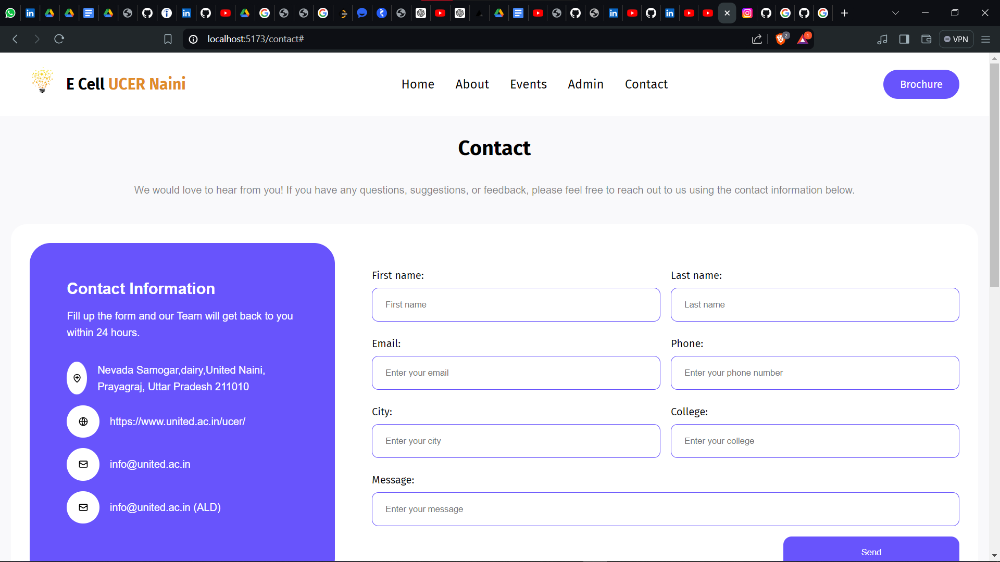

# ECell Repository

Welcome to the ECell repository! This repository contains code, resources, and documentation related to the activities and projects of the Entrepreneurship Cell at our college.

## Table of Contents

- [About](#about)
- [Tech Used](#TechStack)
- [Getting Started](#getting-started)
- [Contributing](#contributing)
- [License](#license)
- [Snapshots](#snapshots)
git
## About

The Entrepreneurship Cell (ECell) is a student-run organization that promotes entrepreneurship and fosters an entrepreneurial mindset among students. This repository serves as a central hub for our projects, events, and resources.

In this repository, you will find:

- Code for our website, mobile apps, or other software projects
- Documentation and guides for various initiatives and events
- Resources related to entrepreneurship, startups, and business development
- Ways to get involved and contribute to ECell

## TechStack
-ReactJS(javascript XML)
-Vite
-CSS+SaSS

## Getting Started

To get started with the ECell repository, follow these steps:

1. **Clone the repository:** Use the following command to clone the repository to your local machine:

         git clone https://github.com/QureshiSohelShafique/Entrepreneurship-Cell-Website.git

2. **Install dependencies:** If the repository contains any projects with dependencies, follow the instructions in the project's README to install the necessary dependencies.

3. **Explore the repository:** Take some time to explore the code, documentation, and resources available in the repository. Feel free to open issues, ask questions, or provide feedback through GitHub's issue tracker.

## Contributing

We welcome contributions to the ECell repository! Whether you want to fix a bug, implement a new feature, or suggest improvements, your contributions are highly appreciated.

To contribute to the repository, please follow these steps:

1. **Fork the repository:** Click the "Fork" button at the top right corner of this repository to create a copy of the repository in your GitHub account.

2. **Create a new branch:** Create a new branch for your contribution. It's recommended to use a descriptive branch name that reflects the purpose of your changes.

3. **Make your changes:** Implement your changes or additions in the codebase. Ensure that your code follows the project's coding guidelines.

4. **Commit your changes:** Commit your changes with a clear and descriptive commit message.

5. **Push your changes:** Push your changes to your forked repository.

6. **Create a pull request:** Go to the original repository and create a pull request to merge your changes into the main branch. Provide a detailed description of your changes and why they should be merged.

Please note that all contributions will be reviewed by the repository maintainers before being accepted.

## Snapshots

## License

The ECell repository is licensed under the Qureshi Sohel Shafique. You are free to use, modify, and distribute the code and resources in this repository, subject to the terms and conditions of the license.

---

We hope you find the ECell repository helpful and engaging! If you have any questions or need assistance, feel free to reach out to the ECell team or open an issue in this repository.

Happy coding and entrepreneurial endeavors!
